# 💼 Scalable OLAP System for Credit Card Transaction Analysis

## 🌟 Overview
This project extends my earlier work on transactional storage (using MongoDB in an OLTP setting) and focuses on building an OLAP system for in-depth analysis of credit card transactions. It involves creating a scalable data warehouse using cloud technologies and modern data engineering practices, designed to provide stakeholders with fast, actionable insights.

🔑 Key Takeaways: 

1. Hands-on experience with AWS S3, Databricks, dbt, and PowerBI.
2. Implementation of Star Schema for OLAP dimensional data modeling.
3. End-to-end data engineering solution from data extraction to visualization.

## 🎯 Objectives:
1. 🏗️ Build a scalable OLAP data warehouse using cloud-distributed storage and data staging techniques.
2. 📊 Design fact and dimension tables following a star schema, optimized for fast querying and analytical tasks.
3. 🛠️ Gain Expertise with cutting-edge tools like Databricks, dbt, and Spark for efficient data processing and transformation.

## 🏢 Use Case: Financial Institution
Financial institutions rely on effective data democratization to make data-driven decisions across departments. This OLAP system allows for tailored data marts, empowering each department with access to customized insights through the data warehouse.

OLAP is the ideal solution here, offering:

1. 💡 Rapid Queries for large datasets.
2. 📂 Organized Data through dimensional modeling, answering key business questions.
3. 📈 Star Schema to facilitate easy reporting and analytics.

## 📚 Contents

- [The Dataset](#-the-dataset)
- [Project Architecture](#-project-architecture)
- [Transaction Batch Processing Pipeline](#-transaction-batch-processing-pipeline)
- [Project Demo Highlights](#project-demo-highlights)
- [Technical Challenges and Solutions](#-technical-challenges-and-solutions)
- [Conclusion](#-conclusion)
- [Future Enhancements](#-future-enhancements)
- [Connect With Me](#-connect-with-me)
- [Appendix](#-appendix)

## 📊 The Dataset
For simplicity, I used data spanning from 01/01/2020 to 02/01/2020, encompassing both legitimate and fraudulent transactions from a simulated credit card transaction dataset obtained from Kaggle.

The data dictionary is shown below:

| **Attribute**              | **Description**                        |
|----------------------------|----------------------------------------|
| `trans_date_trans_time`   | Transaction date and time                     |
| `cc_num`                  | Credit card number                            |
| `merchant`                | Merchant name                                 |
| `category`                | Merchant category                             |
| `amt`                     | Transaction amount                            |
| `first`                   | First name of credit card holder              |
| `last`                    | Last name of credit card holder               |
| `gender`                  | Gender of credit card holder                  |
| `street`                  | Street address of credit card holder          |
| `city`                    | City of credit card holder                    |
| `state`                   | State of credit card holder                   |
| `zip`                     | ZIP code of credit card holder                |
| `lat`                     | Latitude of credit card holder's location     |
| `long`                    | Longitude of credit card holder's location    |
| `city_pop`                | Population of the cardholder's city           |
| `job`                     | Job of the credit card holder                 |
| `dob`                     | Date of birth of credit card holder           |
| `trans_num`               | Unique transaction identifier                 |
| `unix_time`               | Unix timestamp for the transaction            |
| `merch_lat`               | Latitude of the merchant's location           |
| `merch_long`              | Longitude of the merchant's location          |
| `is_fraud`                | Fraud flag (Target variable: 1 = Fraud, 0 = Not Fraud) |

## ⛏️ Project Architecture
The project leverages several key technologies to create a robust OLAP system:

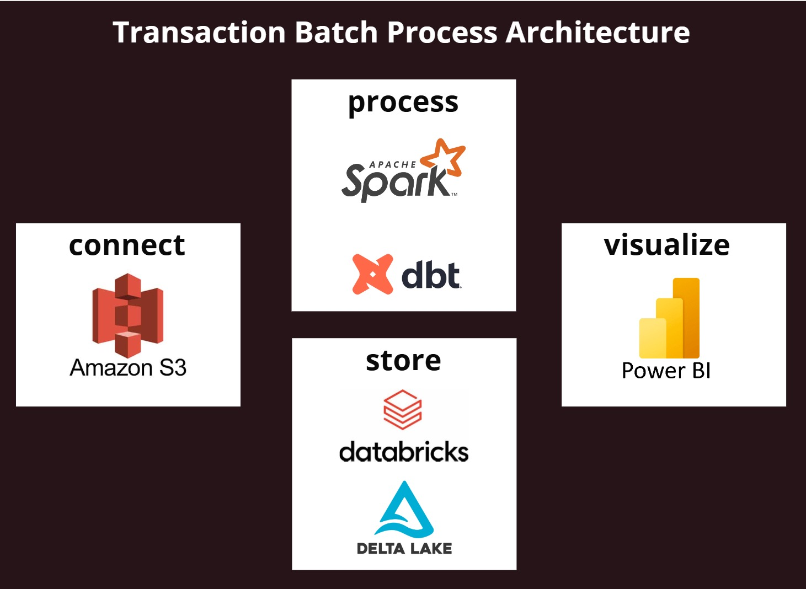

The data processing pipeline consists of four main phases:

1. Connect 🔌: Scripts extract data from the source, transform it, and send it to target storage for further processing.
2. Processing ⚙️: Raw data undergoes transformation and cleaning.
3. Storage 💾: Processed data is stored in a database optimized for analytical queries.
4. Visualization 📈: Tools analyze and display the processed data, enabling data-driven reporting based on organizational needs.

## 🔄 Transaction Batch Processing Pipeline
The batch pipeline highlights the integration of OLTP and OLAP systems. It starts by extracting data from MongoDB, processing it using Spark, and loading it into S3 for further OLAP operations.

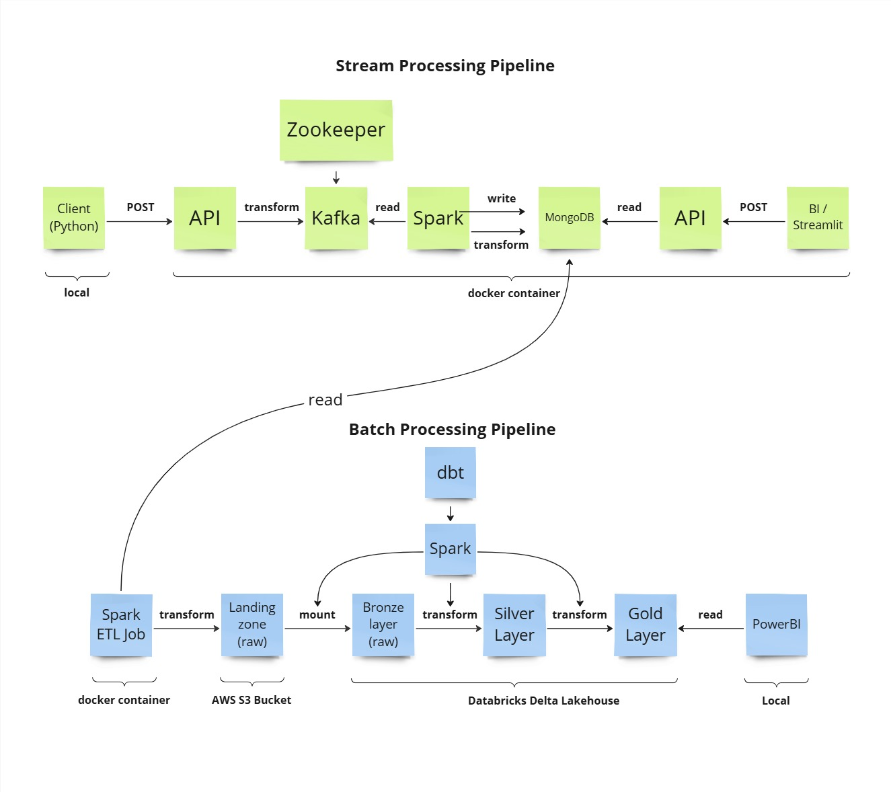

**Note:** Batch Processing Pipeline components are highlighted with blue color stickers. 

The image illustrates the relationship between the previous streaming process of the OLTP system and this OLAP pipeline.

### Detailed Process Flow:

#### Connect
Amazon S3 bucket serves as the data source for this project. The data initially resides in MongoDB (representing the OLTP system storage) and is extracted to S3. This distributed storage solution was chosen to explore AWS cloud services and integrate with Databricks. S3's object storage model, which doesn't use a traditional file hierarchy, aligns well with our data modeling approach.

#### Processing
Spark processing is utilized in two key areas:

1. Data Extraction and Transfer:

- Spark runs in dockerized mode to extract data from MongoDB and transfer it to the S3 bucket.
- The process with sample script in [mongo_to_spark_to_s3.ipynb](./S3bucket/ApacheSpark/mongo_to_spark_to_s3.ipynb).
- After data migration, Databricks is set up and the S3 storage is mounted in the Databricks workspace using [setup_s3_conn.py](./databricks/setup_s3_conn.py)

Key points:
- ensure to have matching JAR package file for Spark-AWS S3 connection
- prepare beforehand required credentials in an `.env` file and set up a S3 bucket
```
example credentials in env file:

AWS_ACCESS_KEY_ID=abc123
AWS_SECRET_ACCESS_KEY=abc123
AWS_DEFAULT_REGION=ap-southeast-5
```
- ensure to run docker-compose (with env) file to enable the said services
```
docker run --env-file /home/user/config/.env -p 8888:8888 -p 4040-4080:4040-4080 pyspark-s3
```
> **Note**: The composed file can be found here [docker-compose.yml](./S3bucket/docker-compose.yml). It should be run first before implementing aforementioned extraction tasks in this project.

2. dbt + Spark (in Databricks):

dbt (data build tool) is used to plan and execute transformations in a DAG (Directed Acyclic Graph) manner within the Databricks lakehouse.
dbt's built-in documentation features provides visibility into data lineage, enhancing collaboration and preventing redundant transformations.
The transformation process creates three schemas (bronze, silver, and gold) following a medallion architecture, with the gold layer containing tables in a star schema format.
Resulting tables in each schema are saved in the Databricks-provisioned S3 bucket.

#### Storage
The Databricks-provisioned S3 bucket serves as the main storage for this OLAP project. Leveraging Delta Lake, a powerful lakehouse feature, it enables optimized storage governed by a unity catalog. The object storage model of S3 aligns well with the medallion architecture, treating each stored table as a separate object, ensuring modularity and isolation between medal layers.

### Visualization
PowerBI is used for data visualization. The implemented dashboard provides a comprehensive overview of credit card transaction data, including customer demographics, location information, and key business metrics. An exception report is also included to facilitate drill-down analysis of fraudulent activities and their details. Refer to  for the sample dashboard created.


## 🪧Project Demo Highlights

0. Data Model / Star Schema Design
- It is essential to setup a model as the final gold layer and I have selected a star schema model for this dimensional modeling task. Generally, for a fact table, it usually contains all measurements by stakeholder interest (usually datatype is type of continuous numerical data). For dimension tables, it is descriptive of what the attribute in fact table is all about.
- In this project, I have proposed potential business questions to start constructing the fact table and created the star schema model below. Refer [Sample_business_requirement.pdf](./Sample_business_requirement.pdf) for guidance on how I select fact dimension using business key metrics.

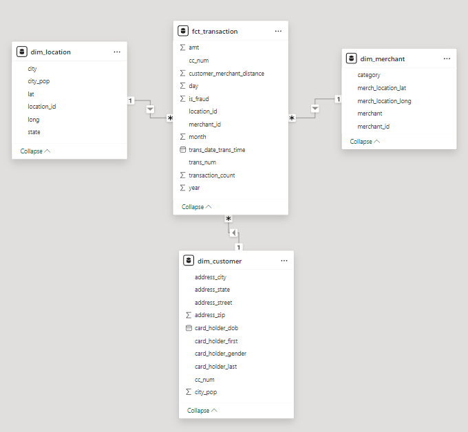

1. S3 Bucket Setup and Naming Conventions
- Sample of filename best practice script and excerpt from AWS official docs

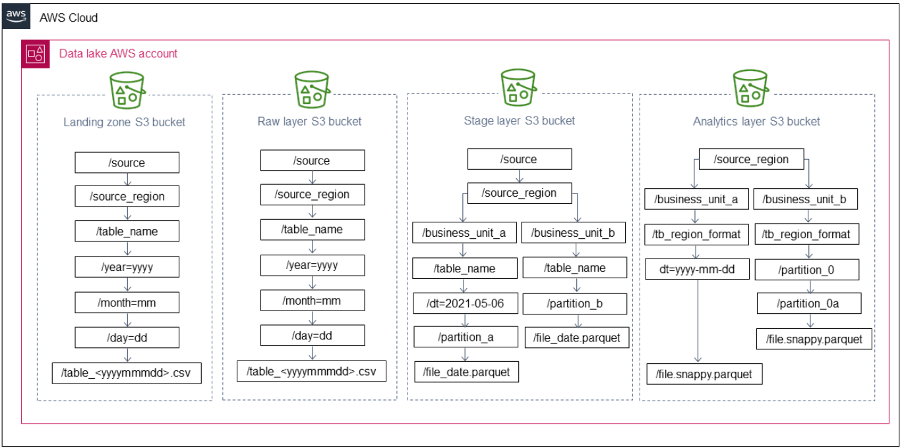.

- Also, below image is the generated partitioned file in bucket using the sample script:

```
input_df.write \
    .partitionBy("year", "month", "day") \
    .mode("append") \
    .option("compression", "gzip") \
    .parquet(output_path)
```
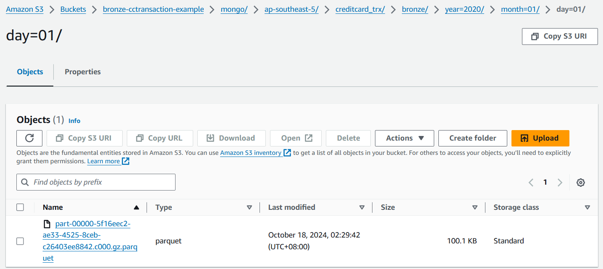

- Sample S3 bucket, my custom bucket `bronze-cctransaction-example` and dedicated Databricks S3 bucket
-- the dedicated S3 bucket is auto created when first initialize the service. It is created with help of AWS CloudFormation which create like a cluster of service require for running Databricks including ec2 instance, dedicated virtual private cloud (VPC), S3 bucket for Databricks allocated configuration and also IAM policy

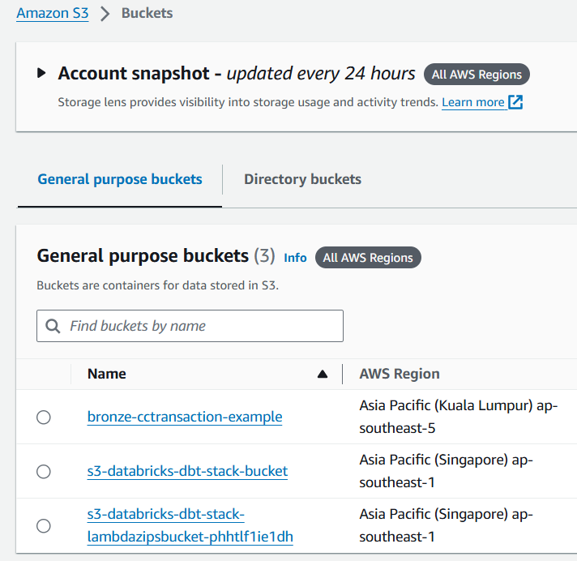

2. Databricks Integration
- Sample script and check on mounting custom S3 bucket on Databricks 

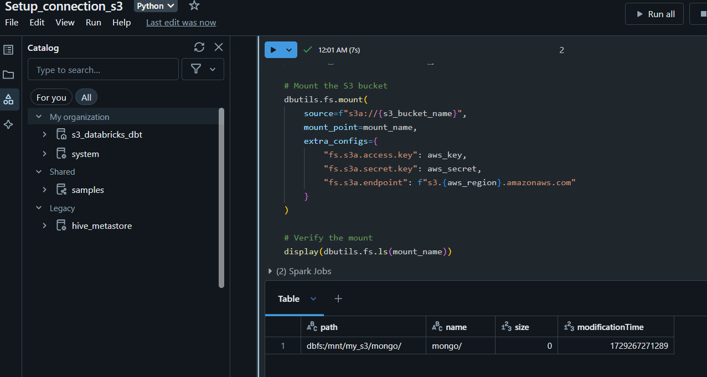

- Upload notebook / script into Databricks' workspace

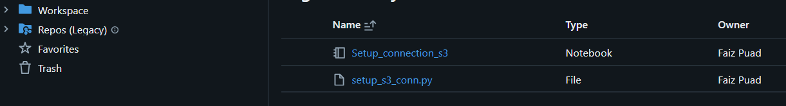

- Sample read custom mounted S3 bucket in Databricks workspace

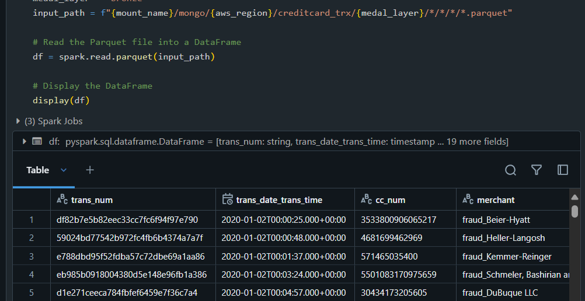

3. Medallion Architecture in Databricks
- the materialized dbt model will turn as table alongside its dedicated schema

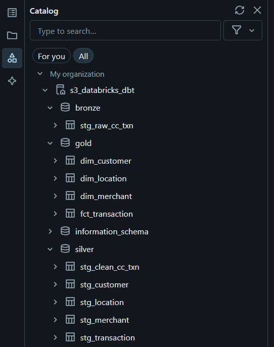

4. dbt Project Structure and Configuration
a. Sample of a new dbt project file structure. Some important folder and files are:
- models : where all the transformation script for medallion layer is placed. Each script might include a schema.yml script that configure testing of data quality, brief column description etc.

example sql model script:
```
{{ config(
    materialized='table',
    file_format='delta',
    partition_by=['year', 'month', 'day'],
    schema='bronze'
) }}

SELECT * FROM TableA
```

example schema.yml:
```
version: 2

models:
  - name: stg_raw_cc_txn
    description: "A starter dbt model"
    columns:
      - name: trans_num
        description: "Unique transaction number"
        tests:
          - not_null
          - unique
```
- macros : consist of function (repetitive task) or even change of default dbt configuration
- seeds : insert data (more like a lookup table)
- profiles.yml : contain configuration setup and target environment (like run script as dev environment etc). Excerpt:
```
databrick_dbt:
  target: dev
  outputs:
    dev:
      type: Databricks
      host: "{{ env_var('Databricks_HOST') }}"
      http_path: "{{ env_var('Databricks_HTTP_PATH') }}"
      schema: "dev"
      token: "{{ env_var('Databricks_TOKEN') }}"
      threads: 1
      database: "s3_Databricks_dbt"
```
- dbt_project.yml : define default materialization,file format and schema of model and even store variable here. Excerpt:
```
models:
  databrick_dbt:
    +database: s3_Databricks_dbt
    bronze:
      +schema: bronze
      +materialized: table
      +file_format: delta
```
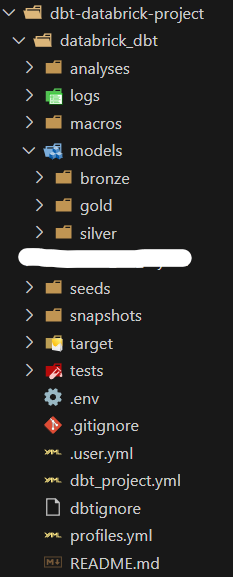

- Sample required connection setting for configuration of dbt-Databricks adapter

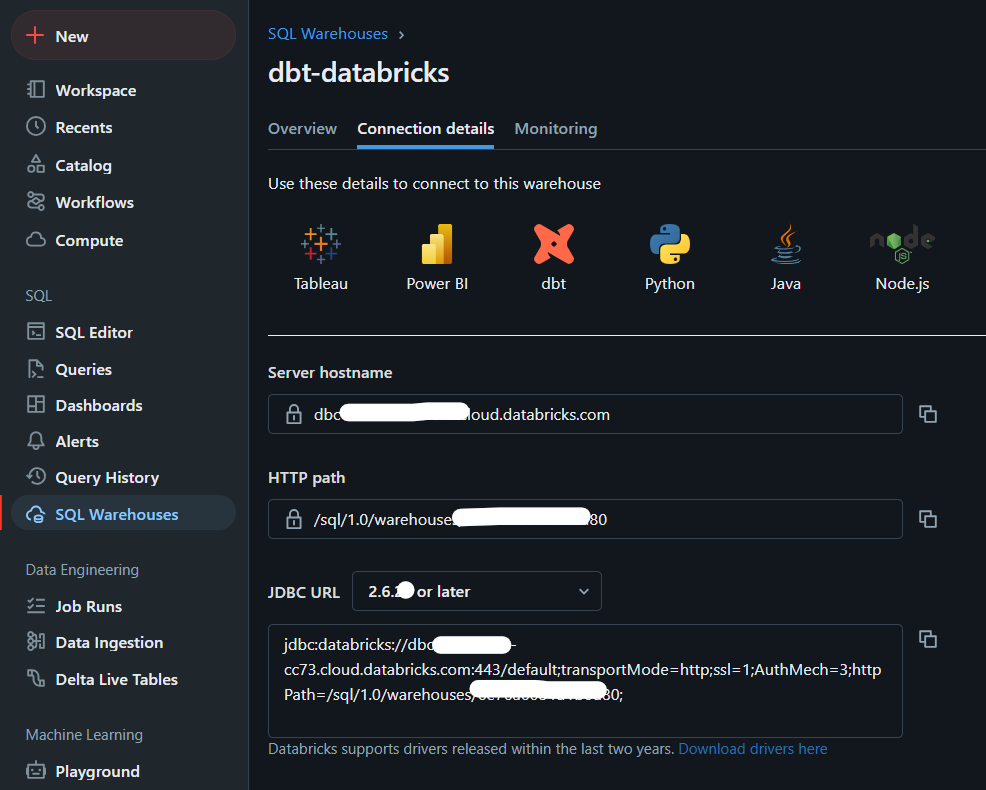

- Sample testing dbt adapter connection to Databricks
-- see in image below the connection is successfully done

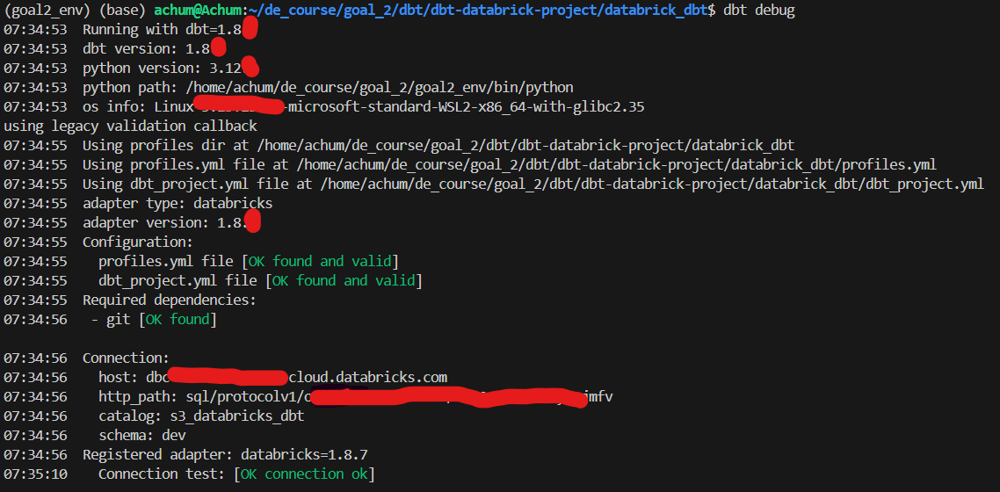

- Sample `dbt run` log after successfully setup all required file in dbt project

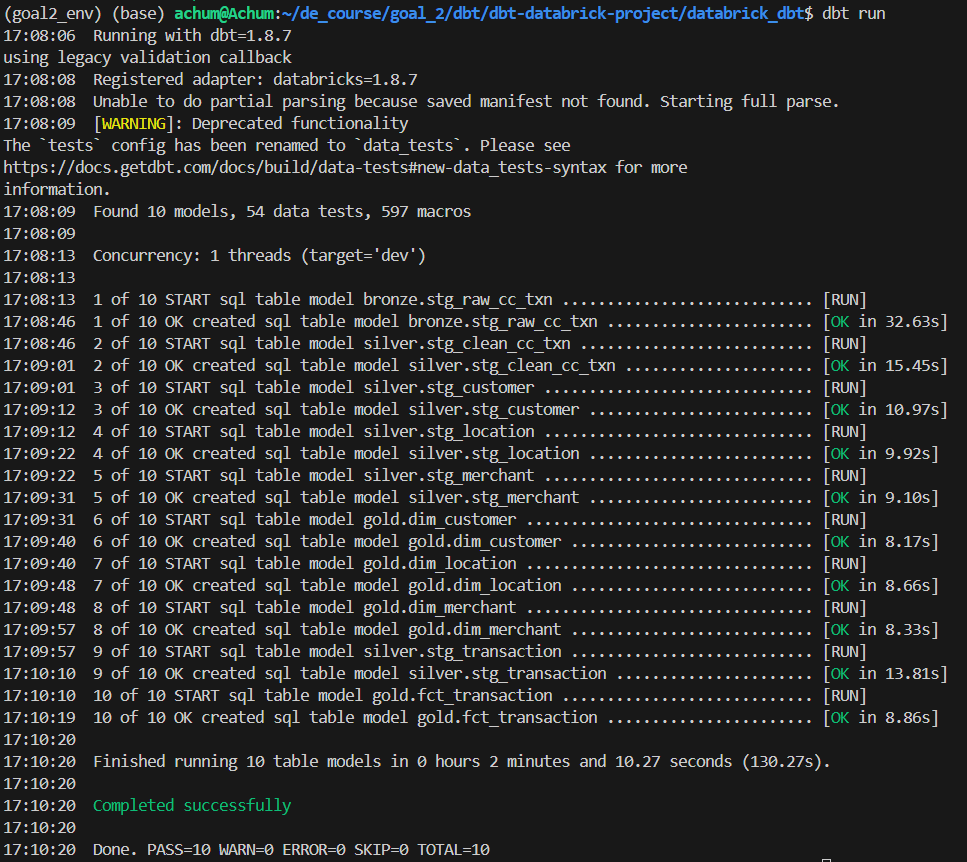

5. Data Lineage and Documentation
- Sample filename save in Databricks' govern S3 bucket
-- the dbt model is materialized with partition on year, month and day

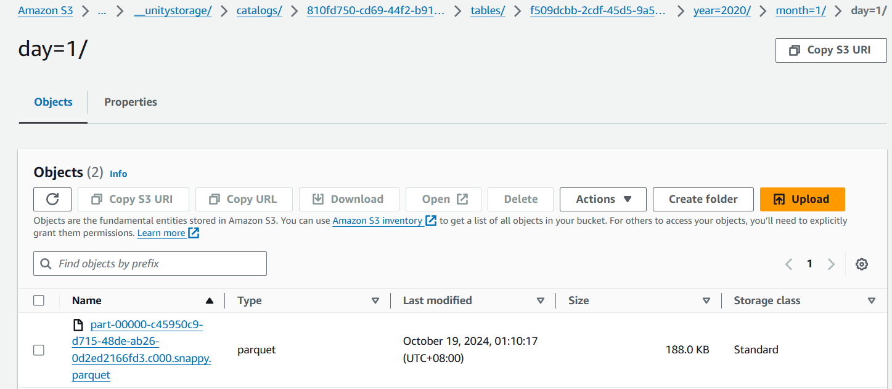

-- another reference is below image, where in unity catalog, the table is stored with random name under file path 'tables' followed by its partition order. I.e., tables/0x312ncvkf/year=2020/month=01/day=01/part-0001-snappy.parquet

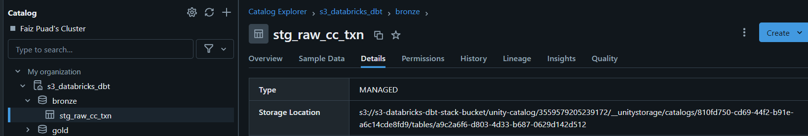

- Database, Schema and table structure from dbt docs
-- dbt provided nice file structure to all schema and tables created using materialize SQL/Python model.  Note that it represents the exact same structure as in file structure in Databricks unity catalog

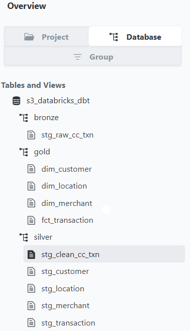

- Sample model/table dependency in dbt docs
-- In image below, the landing data in silver layer act as prerequisite layer for staging (stg_customer,stg_location,stg_merchant, stg_transaction)

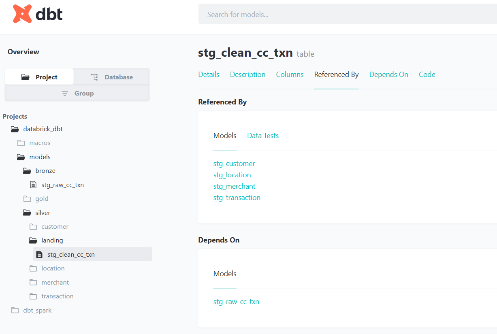

-- Also, dbt docs has lineage graph view option that offers visual DAG relationship of each model as below:

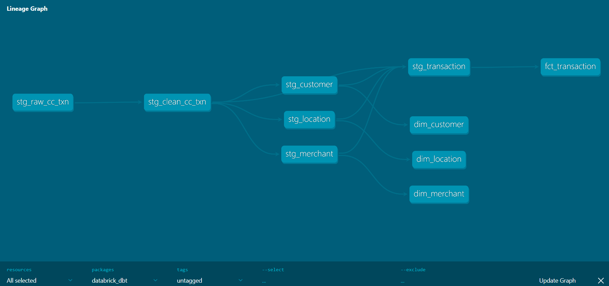

6. PowerBI Dashboard
- Dashboard demo using PowerBI
-- I divided the dashboard into two sections. The first section offers an overview of transaction data, giving users a quick insight into how effectively their service or institution is managing fraud cases. This overview also highlights regions with the highest instances of fraud. The second section presents an exception report, which can be shared with senior management or used by frontline teams to develop remediation strategies for fraud incidents.

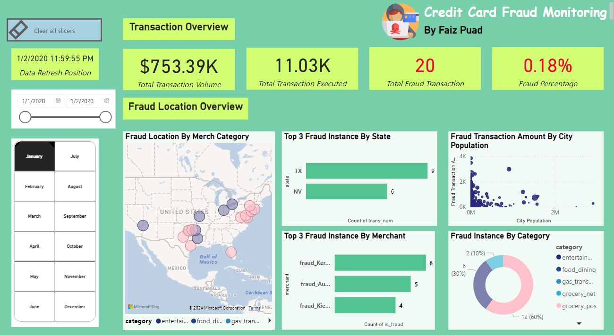

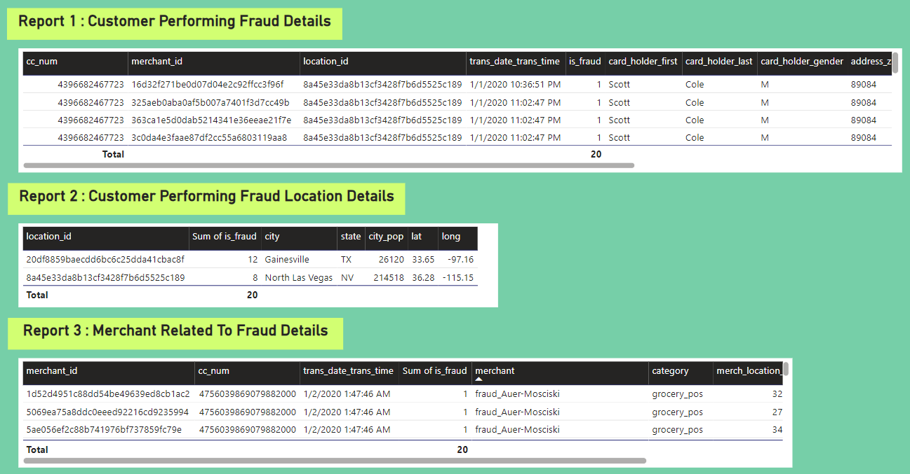

7. Cost Monitoring
- Sample cost monitoring using AWS `Billing and Cost Management` service
-- I have created multiple budget alerts to avoid unwanted spike cost / over budget

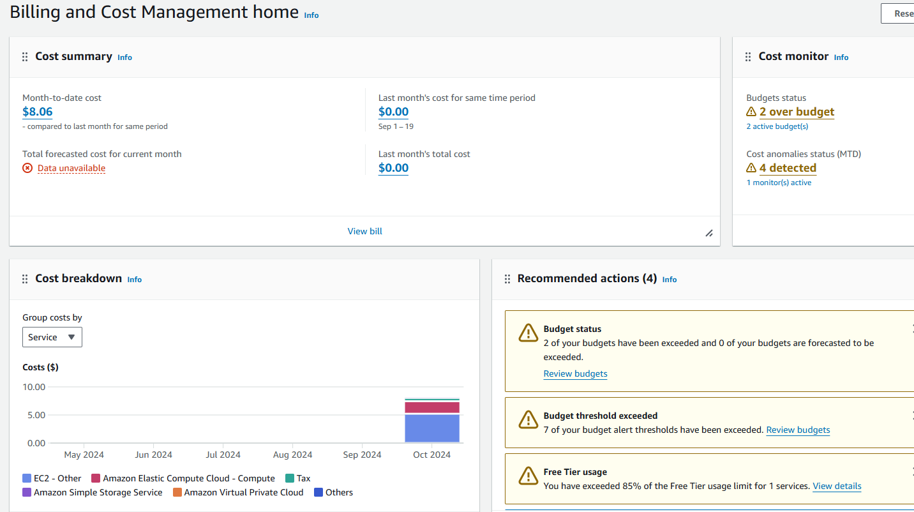

## 🚧 Technical Challenges and Solutions
1. Spark and AWS S3 Connection Setup
- Challenge: Finding compatible versions of aws-java-sdk and hadoop-aws.
- Solution: Identified the Java and Hadoop versions running on the notebook and selected compatible SDK versions.
- Reference materials here: [ref1](https://stackoverflow.com/questions/52310416/noclassdeffounderror-org-apache-hadoop-fs-streamcapabilities-while-reading-s3-d#:~:text=whatever%20version%20of%20the%20hadoop%2D%20JARs%20you%20have%20on%20your%20local%20spark%20installation%2C%20you%20need%20to%20have%20exactly%20the%20same%20version%20of%20hadoop%2Daws%2C%20and%20exactly%20the%20same%20version%20of%20the%20aws%20SDK%20which%20hadoop%2Daws%20was%20built%20with.%20Try%20mvnrepository%20for%20the%20details. )
2. AWS Region Service Connection
- Challenge: It appears that simply setting up compatible software is insufficient. It's also crucial to verify whether the S3 region requires additional configurations, such as enabling the region (I noticed that for new regions like `Kuala Lumpur`, this setup is necessary).
- Solution: Make sure to enable the version at the latest position.
```
-Dcom.amazonaws.services.s3.enableVx=true

where x is the latest version
```
3. Insufficient Compute Storage in Databricks
- Challenge: Encountered storage limitations when creating clusters.
- Solution: Refreshed and created new clusters as a workaround.
4. Python Module Support in dbt
- Challenge: an error occured when I try to use python model with locally host postgres
- Solution: to solve it, there is only 4 services like Databricks, Snowflake compatible with python dbt model. so, it is not possible to use ptyhon dbt model on postgres yet.
5. File Naming in Medallion Architecture
I would like to use different prefixes to indicate which media layer or data mart the file belongs to. For instance, when I create a table by mounting my S3 in the Databricks workspace, Databricks automatically generates filenames for storing data. I discovered that this is a result of the Unity Catalog features. Below is a comparison of naming conventions from my custom S3 setup and the automatically created S3 in Databricks (where the data managed by the Unity Catalog does not allow for flexible or customized naming conventions when saving tables or data).

```
Desired S3: bronze-cctransaction-example.s3.ap-southeast-5.amazonaws.com/mongo/ap-southeast-5/creditcard_trx/bronze/year=2020/month=01/day=01/part-00000-.gz.parquet

Databricks S3: s3://s3-Databricks-dbt-stack-bucket/unity-catalog/3559579205239172/__unitystorage/catalogs/810fd750-cd69-44f2-b91e-a6c14cde8fd9/tables/6e6f9b96-8755-4ab1-b2b4-e1276077bf57
```

I have considered three potential workarounds for this issue:

- Option 1: Perform all transformations in dbt.
    - Benefit: This approach allows me to utilize storage within the Databricks environment. Although the filenames may not be very human-readable, they can still be categorized as different layers, as S3 treats files as objects. I also investigated the bucket in Databricks and found that I can manage aspects such as the encryption key type, lifecycle, and other governance features.

- Option 2: Create an external table in Databricks. I researched this and found that some people recommend using 'location_root' in the dbt model's configuration. This means that the specified 'location_root' will dictate where the file changes are saved.
    - Benefit: This allows me to control the naming prefix at the specified storage location.

- Option 3: Use the Databricks workspace with only PySpark, without dbt.
    - Benefit: This gives me the flexibility to write custom names and choose the storage location easily.

For this project, I have chosen the first option, as I want to maximize the use of Databricks and dbt. While the file naming is determined by the Unity Catalog, I believe that since tables/materialized views are stored as different objects, they still align with the medallion layer structure.

## 🎓 Conclusion
This OLAP system for credit card transaction analysis demonstrates a robust, scalable approach to handling large volumes of financial data. By leveraging cloud technologies like AWS S3 and Databricks, combined with modern data transformation tools like dbt, we've created a powerful analytical platform capable of providing valuable insights into transaction patterns and potential fraudulent activities.

The implementation of a medallion architecture ensures data quality and enables iterative refinement of our datasets. The star schema model in the gold layer facilitates efficient querying and reporting, making it easier for various departments to derive actionable insights from the data.

Through this project, I've gained valuable experience in cloud-based data engineering, distributed computing with Spark, and advanced data modeling techniques. These skills are crucial for tackling real-world big data challenges in the financial sector and beyond.

## 🚀 Future Enhancements
During my journey of exploring the tools locally, I identified several areas for improvement that could have enhanced the project's complexity, as well as improved data quality and governance overall. Below are some thoughts I have in mind:

- Integrate customized data quality tests using dbt or Great Expectations.
- Implement incremental load strategies such as Slowly Changing Dimensions (SCD).
- Utilize Databricks' Auto Loader feature for more efficient data ingestion.
- Merge workflows using Databricks notebooks and local dbt models for a more streamlined process.
- Implement advanced security measures and data masking for sensitive financial information.

## 🤝 Connect With Me
- [LinkedIn](https://www.linkedin.com/in/faizpuad/)

## 📚 Appendix
- [Kaggle Dataset](https://www.kaggle.com/datasets/kartik2112/fraud-detection?select=fraudTrain.csv)
- [Inspiration & Reference from Coach Andreas Kretz Academy](https://learndataengineering.com/)
